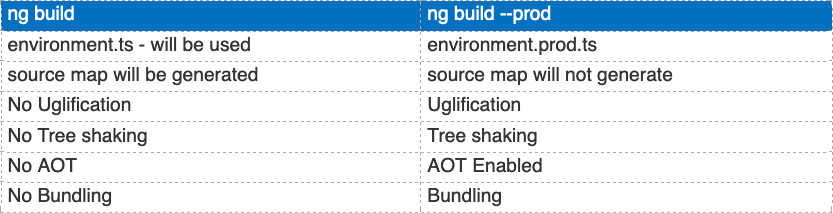

<iframe src="https://docs.google.com/presentation/d/1tq-M1JVgnzPaMWe2gz2Za6ikyiugM7JJeULxeE87MR0/embed?start=false&loop=false&delayms=30000" frameborder="0" width="960" height="569" allowfullscreen="true" mozallowfullscreen="true" webkitallowfullscreen="true"></iframe>

### Angular CLI

The `cli` is a feature rich tool that helps you wire up all of your components so you should use it whenever it makes
sense. The best place to start learning how to use it is the documentation available [here](https://angular.io/cli)

In your workspace run:

`npm i @angular/cli`

🍕 All the most common dependencies of angular are under the `@angular` npm namespace

The `@angular/cli` provides you with a very straightforward way to create a new project. It has multiple options that 
you can use for customizing your project creation and how the command would be run.
Create a new angular project:

1) basic command

    `npx ng new ng-goodreads`

2) as a dry run (check out what will be created)

    `npx ng new ng-goodreads --dry-run`

3) without installing the prerequisites in the project folder

    `npx ng new ng-goodreads --skip-install`

4) defining custom selectors that are unique in our project for the app (we can define multiple apps in the same project)

    `npx ng new ng-goodreads --prefix books`

5) 💫 NEW in Angular 8+ 💫 . Angular 8 allows you to use the last generation rendering engine **_IVY_**. It is the default in Angular 9.

    `npx ng new ng-goodreads --enable-ivy` - Angular 8

    `npx ng new ng-goodreads` - Angular 9

#### And of course like any command line tool it allows you to combine the options

A common set of command line flags that you may use could look something like this:

`npx ng new ng-goodreads —-routing —-prefix books —-style scss —-dry-run`

Something nice about the `@angular/cli` is that it also comes with an interactive prompt that lets you set 
some of the options

### 2 Other cool and useful features
### provided by the `@angular/cli` are the `build` and `serve` commands

#### 1) `npx ng build` - docs [here](https://angular.io/cli/build)

- Mode flag

    `npx ng build --prod`

    

- optimized build - _This should be used with caution as it is 2x the time of a regular build_

    `npx ng build --build-omtimizer`

- output vendor chunks (separate bundles for third party dependecies)

    `npx ng build --vendor-chunk`

- for some bundle analysis you could use `--statsJson` (eg: `webpack-bundle-analyzer`)

    `npx ng build --statsJson`

#### 2) `npx ng serve` - runs your app in dev mode with hot reloading

You can set the various options that you would expect from any type of server application

- `--port`: allows you tospecify the port on which the app is served

- `--proxyConfig`: you can specify a proxy configuration file which can enable you to run the app against 
a custom version of the backend

- `--ssl`: you can serve this using HTTPS in order to have things more reflective of a prod environment for example

- `--sslCert`: specify the cert file for your HTTPS served app

- `--prod`: to serve using prod bundling

- other custom options that are specified in the [docs](https://angular.io/cli/serve)

### We want to add material because we will be using it to help make the application pretty

Add a third party dependency on `@angular/material`

`npx ng add @angular/material`

Add a third pardy dependency on `@angular/cdk`

`npx ng add @angular/cdk`

### Individual exercises:

1) build the app generated via `npx ng build` and analyze the bundles (using webpack-bundle-analyzer)
